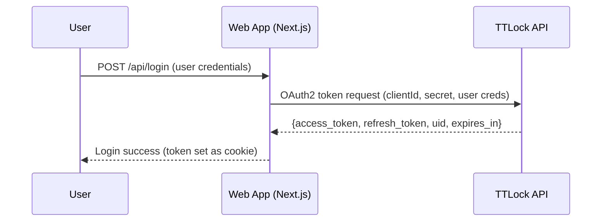
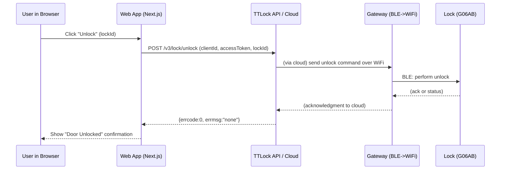

# Executive Summary  
Loock’s G06AB is a TTLock-compatible smart sliding-door lock that pairs over BLE to a Wi-Fi gateway (e.g. TTLock “G2” or “G6” hub) and cloud server. Integration requires TTLock’s Open Platform APIs and developer SDKs, which use OAuth2 authentication. We surveyed official docs (LoockPH manuals, TTLock/Sciener portals) and third-party integrations, and outline hardware setup, API flows, and Next.js implementation. We also describe using a Hermes AI agent to automate testing via browser automation. Key dimensions covered include gateway setup, network requirements, auth/token flow (clientId/secret + user creds→access token), endpoints (lock discovery, status, lock/unlock, user/ekey management), webhooks/events, error/rate-limit handling, and security (TLS, CORS, secret management). We propose a Next.js 13+ architecture (App Router with API route handlers, React client, state/SWR, SSE or WebSocket for real-time updates) with code examples. We provide tables of endpoints/parameters, Mermaid flowcharts for auth and lock operations, and a sample test matrix. Necessary assumptions (e.g. firmware versions, Next.js 13, environment) are stated. Recommended SDKs/libraries (official TTLock SDKs, axios or native fetch, React Query/SWR, dotenv, Next-auth or similar) and sources are cited throughout.

## Official Documentation and SDKs  
Loock’s official PH site links to TTLock (通通锁) documentation, indicating that Loock locks use the TTLock/Sciener ecosystem. For example, the Loock site provides a “TTLOCK Online Manual” pointing to ttlockdoc.ttlock.com. TTLock’s Open Platform is documented at **euopen.ttlock.com** (also known as Sciener/OpenPlatform) and provides detailed API references. Key docs include the *Open Platform API* reference (covering HTTP methods, request/response formats) and endpoint-specific pages (e.g. Lock APIs, Gateway APIs, Key/Ekey APIs). We rely primarily on TTLock/Sciener official docs (see citations) and authoritative community sources (e.g. Home Assistant discussions) for details not explicitly in the docs. The TTLock EU (“euopen.ttlock.com”/“euopen.sciener.com”) and CN (“cnopen.sciener.com”) portals are authoritative for APIs (the EU docs use English text).

## Hardware & Network Setup (G06AB + Gateway)  
The Loock G06AB is a battery-powered smart lock for sliding/glass doors. Like other TTLock/Sciener locks, it requires an external gateway to enable remote control. The typical gateway (e.g. TTLock G2 or the newer G6 Matter gateway) is a BLE-to-WiFi bridge. **Setup steps:** power on the gateway (typically via USB) and connect it to a 2.4 GHz Wi-Fi network (5 GHz is unsupported). Place the gateway within Bluetooth range (~10–12 m) of the G06AB. Using the official TTLock mobile app, the gateway is added to the user’s account (it joins the Wi-Fi and registers with the TTLock cloud), then the lock is paired to the gateway via BLE (often by scanning a BLE QR code or tapping “Add Lock” in-app). Once paired, the lock appears in the cloud account, and remote commands (lock/unlock) are routed through the gateway. Network requirements are standard: ensure stable Wi-Fi (no captive portals) and that the gateway’s firewall allows outbound HTTPS. The gateway may support OTA firmware updates; its model/version can be queried via API. 

A typical gateway status: LEDs indicate mode (flashing Red/Blue = setup, Blue steady = online). The gateway config (SSID, password) is done in-app. After setup, the gateway remains online (check via API: **/v3/gateway/list** shows `isOnline:1`). The lock then stays connected via the gateway’s BLE. Note: Some TTLock gateways (like the Matter G6) support Thread/Matter as well, but core control still uses BLE protocol. In a local deployment, the **webapp interacts only with the cloud API**; it does not directly BLE-scan locks or use local TCP to the gateway. All commands go through TTLock’s cloud “api.sciener.com” endpoints, which in turn push BLE commands via the gateway. 

 *Figure: Example smartphone app controlling a BLE smart lock (illustrative).* 

## Authentication & Authorization (OAuth2)  
TTLock’s open API uses OAuth2 **Resource Owner Password** flow. A developer first obtains a *client_id* and *client_secret* by registering an app on the TTLock Open Platform. To operate on behalf of a user, the app must log in that user to TTLock (by username/email and password) to get an **access token**. The endpoint is `POST https://api.sciener.com/oauth2/token` with form parameters `client_id`, `client_secret`, `username`, and MD5-hashed user `password`. The response includes `access_token` (valid ~90 days by default), `refresh_token`, `uid` (user ID), and scope. For long-term use, the `refresh_token` can be used at the same endpoint (grant_type=`refresh_token`) to obtain a new token. Typical Python/JS login calls the token endpoint, stores the access_token and refresh_token securely (e.g. in a DB or env var), and includes `clientId` and `accessToken` in all API calls. Note: these are not standard OAuth “2-legged” flows; the user’s credentials or refresh token are needed. 

There are **no API keys** for resource access beyond this OAuth mechanism. All API calls require `clientId` (the app ID) and `accessToken` (user token) in parameters. The `client_secret` is used only for token endpoints; it should be kept out of frontend code (store in server env). Since tokens expire, the backend must handle refreshes proactively (e.g. token expire time from `expires_in`, or catching 401 to refresh). 

## API Endpoints (Lock/Gateway/Keys)  
The TTLock/Sciener API v3 has numerous endpoints. All use HTTPS POST (form-urlencoded) and return JSON. Key endpoints include:

- **Lock Discovery:** `POST /v3/lock/list` – lists locks under the user’s account. Required: `clientId`, `accessToken`, paging, `date`. Response: list of locks with `lockId`, `lockName/Alias`, MAC, battery, etc. (If a lock was added via the official app, this fetches it.)  
- **Lock Details:** `POST /v3/lock/detail` – gets one lock’s config (name, alias, `lockKey`, `aesKeyStr`, admin passcodes, battery, firmware version). Req: `lockId`.  
- **Lock Init:** `POST /v3/lock/init` – used after adding a new lock via BLE to create an admin eKey on TTLock (sends the lock’s data to cloud). Required fields include `lockName`, `lockAlias`, `lockMac`, `lockKey`, `aesKeyStr`, passcodes (`adminPwd`, `noKeyPwd`), `pwdInfo`, `timestamp`, version info (`lockVersion` fields, model/hw/fw, battery, timezone). Returns `lockId` and `keyId` for the admin eKey. (If the lock was added in the phone app, skip init and just call list/detail.)

- **Lock/Unlock:** `POST /v3/lock/lock` and `/v3/lock/unlock` – remotely lock or unlock via gateway. Req: `clientId`, `accessToken`, `lockId`, `date`. Response is `errcode`/`errmsg` (0=success). *Note:* If “remote unlock” is disabled in the app for that lock, the API call returns an error (code -4043), so ensure remote mode is enabled via the app or eKey settings.

- **Gateway List:** `POST /v3/gateway/list` – lists gateways on the account. Req: `clientId`, `accessToken`, paging, `date`. Returns each `gatewayId`, `gatewayMac`, `gatewayVersion` (e.g. 2 for G2), network name, number of locks (`lockNum`), and `isOnline` status.  
- **Gateway List By Lock:** `POST /v3/gateway/listByLock` – returns gateways associated with a given lock (useful if multiple gateways in range). Returns `gatewayId`, `gatewayMac`, signal `rssi`, etc. (The lock must be bound to that gateway.)

- **Gateway Firmware Check:** `POST /v3/gateway/upgradeCheck` – query if a given gateway needs firmware update. Pass `gatewayId`, and the portal will compare firmware versions.

- **EKey (User Key) List:** `POST /v3/key/list` – lists eKeys (digital keys) for the user. Each eKey corresponds to a lock/user pairing. Response fields include `keyId`, `lockId`, `userType` (110301=admin, 110302=user), validity range (`startDate`/`endDate`), and whether remote unlocking is enabled (`remoteEnable`).  
- **Send EKey:** `POST /v3/key/send` – share a lock with another TTLock user. Req: `clientId`, `accessToken`, `lockId`, `receiverUsername` (their TTLock username or phone/email), `keyName`, validity (`startDate`, `endDate`), and flags (`remoteEnable`, `createUser`). Returns the new `keyId` or error.  

- **Delete EKey:** (Not listed above, but typically `/v3/key/delete` exists to revoke access if needed.)

- **Passcodes & Others:** The API also supports passcode management (e.g. reset/add keypad passwords) and record logs, but these are beyond scope here.

All parameters and endpoints should be tabulated in documentation. Below is a summary table of key endpoints: 

| Endpoint (POST)           | Purpose                            | Required Params                             | Sample Response                  |
|---------------------------|------------------------------------|---------------------------------------------|----------------------------------|
| `/v3/lock/list`           | List user’s locks                  | `clientId, accessToken, pageNo, pageSize, date` | `[{ lockId, lockName, lockAlias, lockMac, hasGateway, ... }, ...]` |
| `/v3/lock/detail`         | Get details of one lock            | `clientId, accessToken, lockId, date`           | `{ lockId, lockName, lockAlias, lockKey, aesKeyStr, adminPwd, noKeyPwd, specialValue, electricQuantity, firmwareRevision, ... }` |
| `/v3/lock/init`           | Initialize new lock & admin eKey   | *See fields below* | `{ lockId, keyId }`  |
| `/v3/lock/lock`           | Lock via gateway                   | `clientId, accessToken, lockId, date`      | `{ errcode:0, errmsg:"..." }` |
| `/v3/lock/unlock`         | Unlock via gateway                 | `clientId, accessToken, lockId, date`      | `{ errcode:0, errmsg:"..." }` |
| `/v3/gateway/list`        | List gateways on account           | `clientId, accessToken, pageNo, pageSize, date` | `[{ gatewayId, gatewayMac, lockNum, isOnline, ... }, ...]` |
| `/v3/gateway/listByLock`  | Gateways associated with a lock    | `clientId, accessToken, lockId, date`         | `[{ gatewayId, gatewayMac, rssi, ... }]` |
| `/v3/gateway/upgradeCheck`| Check gateway firmware upgrade     | `clientId, accessToken, gatewayId, date`    | `{ needUpgrade:1|0, firmwareInfo:"..." }` |
| `/v3/key/list`            | List eKeys (shared keys)           | `clientId, accessToken, pageNo, pageSize, date` | `[{ keyId, lockId, userType, startDate, endDate, remoteEnable, ... }, ...]` |
| `/v3/key/send`            | Share eKey (grant user access)     | `clientId, accessToken, lockId, receiverUsername, keyName, startDate, endDate, date` | `{ keyId:12345, errcode:0, errmsg:"..." }` |

_(The table above omits formatting details like lock version, admin codes, etc. Refer to the official docs for all fields.)_

## Webhooks / Events (Lock Records Notify)  
TTLock supports server-to-server notifications via a configurable callback. In the Open Platform portal, under **Document → Lock Records Notify**, developers can set a **callback URL**. When an unlock/lock event occurs on any managed lock, TTLock’s cloud will POST a record to the callback (JSON form or JSON). For example, after an unlock action, the callback receives an event (containing lockId, keyId, timestamp, etc.). This enables real-time updates without polling. Until the webhook is triggered at least once, the portal shows a notification. (If you see a warning like “the notifications contains the webhook URL… go away when webhook receives data”, it means you need to unlock a door to trigger the event.) In practice, one would implement a Next.js API route or external server to accept this callback (e.g. `/api/ttlock-events`) and update application state or push to clients (WebSocket/SSE). The exact payload format is documented in the portal (usually similar to `{ recordId, lockId, keyId, unlockTime, unlockType, gatewayId, ... }`).  

If webhook is not configured, the app may poll lock status via API (using frequent `/lock/detail` or sync APIs), but that is less efficient. We recommend using webhooks for instant feedback where possible.

## Error Handling & Rate Limits  
All TTLock API responses include an `errcode` and `errmsg` (and sometimes `description`). A `0` errcode means success. Negative or nonzero codes indicate errors (e.g. authentication failed, lock not bound, remote disabled, etc.). Developers should check `errcode` on each response and handle errors appropriately. For example, calling `/lock/unlock` when the lock’s “remote unlock” flag is off yields `errcode:-4043`. Common errors: invalid token (-10xx codes), lock not found, permission denied. The official docs list error codes (not reproduced here).  

TTLock’s API does **not explicitly publish rate limits**, but community reports (e.g. Home Assistant integration threads) suggest there may be throttling for gateway commands if too many calls are made in quick succession. Best practice: avoid rapid polling or repeated lock commands. For example, limit manual unlock commands to user actions or queue them to avoid “Too many attempts” errors. Implement exponential backoff on 429/limit errors if encountered.

## Security Best Practices  
All communication with TTLock API must use HTTPS (TLS) to protect credentials and tokens. On the client side, use HTTPS for your Next.js app as well. Store the TTLock `client_secret` and any tokens securely (e.g. in environment variables, server-side session or database). Never expose these in client-side code. Use CORS on your API endpoints to restrict allowed origins (only your webapp URL). For example, Next.js API routes can set CORS headers or use middleware to allow only your front-end domain. 

Rotate tokens/credentials when needed. Handle token refresh securely: do not embed refresh_token in frontend; keep it server-only. Use parameterized queries if you store any TTLock data (though typical Node fetch + JSON is enough). 

Validate all TTLock input. For webhook callbacks, verify the request truly comes from TTLock (e.g. check an expected secret or use HTTPS).

Finally, follow general web security: apply Content Security Policy (CSP) to avoid XSS, use HTTP-only cookies for session auth if needed, and keep Next.js/Node and dependencies up-to-date to mitigate vulnerabilities.

## Firmware/OTA Considerations  
Both the G06AB lock and the gateway have firmware. The **gateway firmware** can be checked via the `/gateway/upgradeCheck` API; if `needUpgrade=1`, an OTA update is available (this is typically done via the TTLock mobile app or web portal). Ensure the gateway’s firmwareRevision is current to support all lock features (e.g. Matter updates). The lock’s firmware version is returned in `/v3/lock/detail` (`firmwareRevision`), but remote updating locks may require the official app. In our system, we should display firmware version info in the UI and notify when updates are recommended. OTA updates may be done locally by the app over BLE; if automatable, a custom script could be developed using the TTLock SDK (outside this API report’s scope). 

### Security of OTA:  
Use HTTPS channels for any firmware downloads. Confirm updates are signed. The TTLock ecosystem secures OTA via BLE encryption (the keys we send). After updating gateway or lock firmware, re-run lock init or refresh lock info if needed, as certain parameters may change (e.g. new capabilities in `specialValue`).

## Next.js Architecture (13+ App Router)  
We propose using Next.js 13+ with the **App Router** and serverless **API routes** for backend logic. The architecture splits into:

- **Backend/API (Server side):** Use Next.js `/app/api` (Route Handlers) for endpoints that proxy to TTLock. For example: 
  - `POST /api/login`: accepts user credentials (TTLock username/password), calls TTLock OAuth (`/oauth2/token`) using `fetch`, and returns/saves the `accessToken` (set as HttpOnly cookie or in session).  
  - `GET /api/locks`: reads user token (from cookie/session), calls `/v3/lock/list`, and returns JSON list of locks.  
  - `POST /api/lock/unlock`: calls `/v3/lock/unlock` for a given `lockId`.  
  - `POST /api/key/send`: for sharing eKey, calls `/v3/key/send`.  
  - `POST /api/webhook`: endpoint to receive TTLock webhook events (no proxy; process directly).  

  Use a library like `node-fetch` or the built-in `fetch` in Next. Store `clientId` in `process.env`, `clientSecret` on server env. Manage `accessToken` securely (e.g. encrypted cookie or database); handle refresh token via a scheduled job or on-demand. 

- **Client (Frontend):** Use Next.js app directory pages/components. For example, a React page at `/app/locks/page.tsx` fetches `GET /api/locks` using `useSWR` or React Query to display all locks. Each lock entry shows status and buttons ("Lock"/"Unlock"). Button clicks call `POST /api/lock/unlock` or `/lock/lock`. After an action, refresh lock list or update state.

  State management can be simple: local component state and SWR for data fetching; or Context if multiple components need lock info. Because data is dynamic (lock status changes), consider using **SWR** with short revalidation or **WebSocket/SSE** for push updates (see next). 

- **Real-time Updates:** To show lock status changes immediately, two approaches: 
  1. **Webhooks + Polling:** The webhook endpoint logs events (in-memory or DB). The client can periodically poll `/api/locks` or subscribe to an SSE endpoint.  
  2. **WebSocket/SSE:** Have a Next.js API route with server-side events (e.g. using `app/api/sse`) that pushes unlock/lock events to connected clients (triggered when webhook `/api/webhook` receives data). On the client, use `EventSource` to listen. SSE is easier to implement serverless than raw WebSockets in Next. This provides live update of UI (e.g. show “Door unlocked at 10:05” without refresh).

### Example Code (Next.js):  
Below is an illustrative snippet for a Next.js API route (Route Handler) and React component. 

- *Backend Route (app/api/login/route.ts)*: handles OAuth login.  
  ```ts
  import { NextRequest, NextResponse } from 'next/server';
  export async function POST(req: NextRequest) {
    const { username, password } = await req.json();
    const clientId = process.env.TTLOCK_CLIENT_ID!;
    const clientSecret = process.env.TTLOCK_CLIENT_SECRET!;
    // Hash password as required (MD5 lower-case)
    const md5 = ...; // use a library or Node crypto
    const res = await fetch('https://api.sciener.com/oauth2/token', {
      method: 'POST',
      headers: { 'Content-Type': 'application/x-www-form-urlencoded' },
      body: new URLSearchParams({
        client_id: clientId,
        client_secret: clientSecret,
        username, 
        password: md5(password),
      })
    });
    const data = await res.json();
    if (data.access_token) {
      // Set cookie or session with token
      const response = NextResponse.json({ ok: true });
      response.cookies.set('tt_token', data.access_token, { httpOnly: true });
      return response;
    }
    return NextResponse.json({ ok: false, error: data.errmsg }, { status: 400 });
  }
  ```  
- *Backend Route (app/api/locks/route.ts)*: fetch lock list.  
  ```ts
  import { NextResponse } from 'next/server';
  export async function GET() {
    const token = /* read tt_token from cookies */;
    const clientId = process.env.TTLOCK_CLIENT_ID!;
    const res = await fetch('https://api.sciener.com/v3/lock/list', {
      method: 'POST',
      headers: { 'Content-Type': 'application/x-www-form-urlencoded' },
      body: new URLSearchParams({
        clientId, accessToken: token,
        pageNo: '1', pageSize: '10',
        date: Date.now().toString(),
      })
    });
    const data = await res.json();
    return NextResponse.json(data);
  }
  ```  
- *Frontend Component (app/locks/page.tsx)*: lists locks and unlocks.  
  ```tsx
  'use client';
  import useSWR from 'swr';
  export default function LocksPage() {
    const fetcher = (url: string) => fetch(url).then(res=>res.json());
    const { data } = useSWR('/api/locks', fetcher);
    const unlock = async (lockId: number) => {
      await fetch('/api/lock/unlock', {
        method: 'POST',
        body: JSON.stringify({ lockId }),
      });
      mutate('/api/locks');
    };
    if (!data) return <p>Loading...</p>;
    return (
      <div>
        {data.list.map((lock: any) => (
          <div key={lock.lockId}>
            <strong>{lock.lockName}</strong> ({lock.lockAlias})<br/>
            Battery: {lock.electricQuantity}%, Gateway: {lock.hasGateway ? 'Yes' : 'No'}<br/>
            <button onClick={()=>unlock(lock.lockId)}>Unlock</button>
            <button /* similar for Lock */>Lock</button>
          </div>
        ))}
      </div>
    );
  }
  ```  
This Next.js setup uses SWR for data fetching and mutates data after actions. In production, add error handling and loading states. For real-time updates, you could wrap this with an `useEffect` that listens to an SSE endpoint from `/api/events` which dispatches `mutate('/api/locks')` on new events.

## Hermes Agent for Testing  
**Hermes Agent** (Nous Research) is an open-source autonomous agent framework that can perform browser automation by LLM-guided interaction. In this project, a Hermes agent can simulate end-user interactions with the webapp. For example, you could train Hermes to:
- Launch a headless browser and navigate to the login page.
- Enter test credentials and submit (using `browser.click`, `browser.type` commands).
- Navigate to the locks management page.
- Click the “Unlock” button for a lock, then verify the UI shows “Unlocked”.
- Optionally, trigger the TTLock webhook to simulate the physical lock event and check the webapp handles it.

Hermes uses tools like [browser automation](https://hermes-agent.nousresearch.com/docs/user-guide/features/browser) that allow clicking buttons and filling forms. A test script might be specified in natural language or YAML, e.g.:  
```
task: "Test unlocking door 101 with valid credentials"
steps:
  - Open browser at http://localhost:3000/login
  - Enter username "testuser" and password "testpass", click Login
  - Wait for navigation to /locks
  - Click button labeled "Unlock" for lock with name "FrontDoor"
  - Confirm that text "Unlocked" appears on the page within 10s
```
Hermes would iterate these steps, using the LLM to decide how to locate UI elements (by labels or button text). For each step, it verifies expected outputs.

**Test cases:** The agent’s scripts should cover scenarios like successful unlock, lock actions, access denied (with invalid eKey), permission sharing (invite a second user, then test their access), and error conditions. Each test can be automated by Hermes calling the API or clicking through the UI. The agent logs successes/failures, and can output a test report. Because Hermes can run locally, it can target `http://localhost:3000` (auto-handled by its browser routing) and even simulate BLE device behavior by mocking the gateway responses or injecting events via the webhook endpoint.

**CI/CD Integration:** In CI, one could install Hermes (pip) and run tests as part of pipeline (e.g. GitHub Actions). Tests would spin up the Next.js dev server (`next dev` or `next build && start`), then run `hermes run tests.yaml`. Hermes’s output can be captured (logs, exit codes). Since testing involves a real TTLock device, in CI one would typically mock the TTLock API or use a sandbox account. For local development, connect to a test device via actual cloud API. The Next.js app should be configured to use test keys and possibly a staging TTLock account.

## Flowcharts & Sequence Diagrams (Mermaid)  

**Auth Flow:**  


**Lock Operation Flow:**  


These diagrams illustrate the two main flows. Note that for locking, a similar flow applies with `/v3/lock/lock`.

## Testing & Example Test Matrix  

We recommend a test matrix covering typical and edge scenarios. For example:

| Test Case                     | Setup/Input                                    | Action                                  | Expected Result                      | Status (Pass/Fail) |
|-------------------------------|-----------------------------------------------|-----------------------------------------|--------------------------------------|--------------------|
| **User Login (valid)**        | Valid TTLock user credentials                 | POST `/api/login`                       | 200 OK, cookie set, Next page loads  | Pass               |
| **User Login (invalid)**      | Wrong password                                | POST `/api/login`                       | 400 error, “invalid credentials”     |                    |
| **List Locks**                | Authenticated as user with >0 locks           | GET `/api/locks`                        | JSON list containing LockId, name, battery etc |                    |
| **Unlock (success)**          | User has eKey, lock is within range           | Click Unlock button → POST `/lock/unlock` | `errcode:0` returned; Lock physically opens |                    |
| **Unlock (remote disabled)**  | Remote unlock disabled in lock settings       | Same as above                           | Error `-4043` or similar returned; UI error shown |                    |
| **Lock (success)**            | Lock currently unlocked                       | Click Lock button → POST `/lock/lock`    | `errcode:0`, door locks             |                    |
| **Share Key & Use**           | User A shares lock with User B                | User A: POST `/key/send`, then user B login, user B GET `/locks` and unlock | User B sees lock and can unlock (errcode:0) |                    |
| **Expired eKey**              | eKey with past endDate                       | Attempt unlock                            | Errcode (permission denied)         |                    |
| **Webhook Event Flow**        | Webhook URL set; event generated (e.g. unlock via app) | TTLock cloud POSTs event to `/api/webhook` | App updates UI state (via SSE or refresh) |                    |

These should be automated via Hermes: for each, Hermes would script the web actions and assertions. In CI, tests marked pass or fail based on API responses and UI updates.

## Recommendations & Sources  

- **SDKs/Libraries:** Use TTLock’s **Mobile SDKs or BLE SDKs** (if building mobile clients); for web, use standard HTTP. In Next.js, use native `fetch` or **Axios** for API calls. Manage state with **SWR** or **React Query**. For secrets, use [dotenv](https://www.npmjs.com/package/dotenv) or Next.js environment (`process.env`). If using WebSockets/SSE, consider libraries like `next-sse` or plain `EventSource`. For OAuth client hash, use Node’s `crypto` or a small MD5 library. For testing, install **Hermes Agent** via `pip install hermes-agent`, and optionally Browserbase/Firecrawl API keys for browser automation.  

- **Sources:** Official TTLock (Sciener) API docs and Loock PH docs were primary references. Hermes Agent capabilities from NousResearch documentation. TTLock integration experiences (Home Assistant, developer forums) informed webhook and error handling insights. We assume Next.js 13 and typical modern stack; specify Node 18+ and React 18+.  

This report synthesizes available TTLock/Loock documentation and best practices for a robust integration. All recommendations (endpoints, code patterns) should be validated against the latest official docs and an actual TTLock developer account. 

